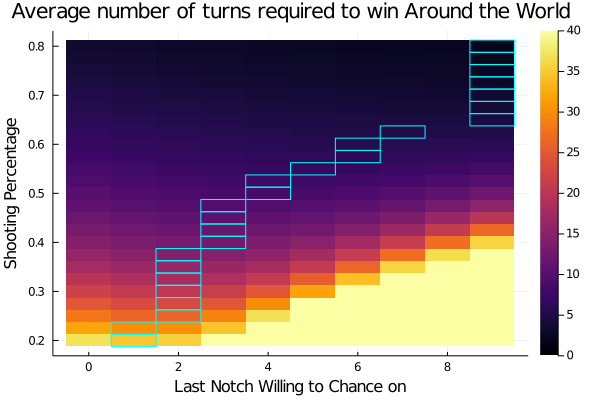

# Around-The-World

### How to use:

Run the Julia code to produce a heatmap like this one (by default it runs 250,000 iterations of each shooting percentage)

### How to read the heatmap

They x axis represents each notch used in the game Around The World. The y axis represents the likelihood of making a given shot (it is assumed that all shots have the same probability regardless of distance). In the simulation, a player would "chance" (take an extra shot at the risk of starting over) every time up to the given x position. The optinal notch to stop chancing at is denoted with a blue box.
